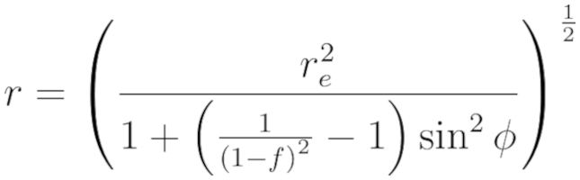
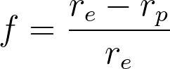
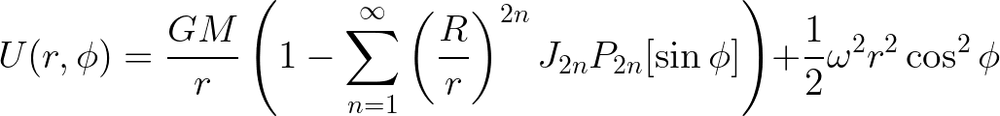
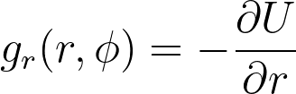
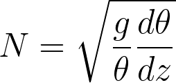
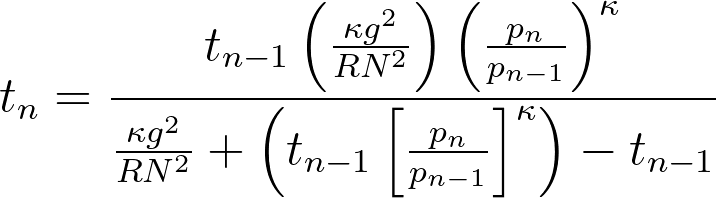
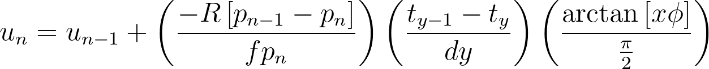

# tweModel.py Methods Document

This document details each step of the atmosphere modelling routine. It goes through [tweModel.py](../tweModel.py) and explains the physics and equations behind each calculation step.

### Creating a Latitude Array

The latitudes at which the model is evaluated are generated using [`np.linspace()`](https://numpy.org/doc/stable/reference/generated/numpy.linspace.html). The 1D array runs from phiStart to phiStop with phiSteps evenly spaced samples, including the endpoints. Each of these parameters are supplied by the user in [config.ini](../config.ini).

### Creating a Pressure Array

The pressures at which the model is evaluated are geneated using [`np.geomspace()`](https://numpy.org/doc/stable/reference/generated/numpy.geomspace.html). The 1D array runs from p_0 to pFinal with pSteps samples, including the endpoints. Each of these parameters are supplied by the user in [config.ini](../config.ini). The pressure array is logaritmic; there are more pressure levels near the top of the atmosphere, where we have better knowledge and we're most interested in, than the bottom. 

### Interpolate Input Temperatures to Model Latitudes

After creating our latitude/pressure grid, we need to interpolate the input cloud-top temperatures to it. We do this using [`np.interp()`](https://numpy.org/doc/stable/reference/generated/numpy.interp.html), which performs a 1D linear interpolation.

Optionally, if the user supplies both a "low" and "high" temperature dataset, the code performs a mean between the two after interpolation.

### Interpolate Input Zonal Winds to Model Latitudes

In a similar manner to the temperatures, input winds are interpolated to our grid using [`np.interp()`](https://numpy.org/doc/stable/reference/generated/numpy.interp.html).

### Calculate the Radius at each Latitude from Planet Flattening

As planets are oblate spheroids rather than perfect spheres, we need to account for both the radius and local gravity at each latitude. We calculate the ellipsoidal radius with the equation

**(1)** 

where *r* is the ellipsoidal radius at latitude *&phi;*, *re* is the equatorial radius of the planet, and *f* is the flattening defined by

**(2)** 

where *rp* is the polar radius of the planet. 

### Calculate the Local Gravity at Each Radius

We then use the calculated radii to find the local gravity at each latitude in the model. To do this, we use the shape of a rotating planet in hydrostatic equillibrium. The equation for a level of equal effective potential *U* is:

**(3)** 

where *G* is the universal gravitational constant, *M* is the planet's mass, *r* is the ellipsoidal radius at latitude *&phi;* calculated with Eq. 2, *R* is the radius at which the zonal harmonic coeffecients *J2n* have been normalized (usually *ee*), *P2n* are the even Legendre polynomials, and *&omega;* is the angular velocity of the planet. Since:

**(4)** 

we can take the partial derivitive of Eq. 3 with respect to *r* to get an equation form local gravity at each point in our model. Using only the first order term, this results in:

**(5)** 

The resulting gravity array is then fit with a polynomial using [`np.polyfit()`](https://numpy.org/doc/stable/reference/generated/numpy.polyfit.html) to remove oscillations caused by the first-order approximation.

### Propogate Cloud-Top Temperatures down by Assuming a Constant Brunt-Väisälä Frequency

The Brunt-Väisälä frequency, *N*, is one measure of a fluid's static stability. It is the frequency at which a vertically displaced parcel will oscillate and must be real in a stable atmosphere. It is given by the equation

**(6)** 

Where *g* is the local gravity found with Eq. 5, *&theta;* is the potential temperature, and *z* is the altitude. 

If we rewrite Eq. 6 in terms of pressure and temperature, discretize it, and solve it for *tn* (the temperature at pressure *pn*) we get

**(7)** 

where *tn-1* is the previous temperature at pressure *pn-1*, *R* is the specific gas constant of the atmosphere, and *&kappa;* is the Poisson constant = *R*/*cp* where *cp* is the specific heat at constant pressure of the atmosphere. 

As we approach the lower pressure bound of the model, we apply a smoothing function such that the horizontal temperature gradient becomes zero. This results in homogeneous temperatures at pFinal. The smoothing takes the form

**(8)** 

where *y* is the contribution from the mean temperature at a pressure level (values 0 to 1), *x* is the index of the pressure level from the cloud top, *i* is a term controlling the pressure level to start smoothing, and *t* is a term controlling how quickly *y* grows.

### Calculate Densities

We calculate density at each point in the model using our temperature grid using the ideal gas law

**(9)** 

where *&rho;* is the density and *R* is the specific gas constant of the atmosphere.

### Propogate Cloud-Top Zonal Winds with the Geostrophic Thermal Wind Equation

The geostrophic form of the thermal wind equation (TWE) relates the geostrophic balance between the Coriolis and pressure-gradient forces in the horizontal to hydrostatic balance in the vertical. It shows the vertical wind shear that arises from a given horizontal temperature gradient. The "textbook" form of the TWE from Holton 1992[^1] is:

**(10)** 

where *Tv* is virtual temperature, *y* is the "northward distance" between two latitudes,  *p* is pressure, *md* is the mass per molecule of dry air, *k* is the Boltzmann constant, *u* is the zonal wind, and *f* is the Coriolis parameter:

**(11)** 

where *&Omega;* is the planet's rotation rate and *&phi;* is the latitude. The discretized form implimented in [tweModel.py](../tweModel.py) is given by

**(12)** 

where *un* and *pn* are the current wind and pressure, *un-1* and *pn-1* are the previous, vertically-displaced wind and pressure, *ty* is the current latitude's temperature, *ty-1* is the previous latitude's temperature, and *x* is a tuning parameter that determines how fast the third "equatorial" term grows. The third term serves to "turn off" the contribution from *f* near the equator to prevent *u* blowing up to infinity as *f* approaches zero. *dy* is the "northwards distance", or the north/south distance between the latitudes that *ty* and *ty-1* are measured at. It is given by

**(13)** 

where *&phi;1*, *&phi;2*, and *&phi;mid* are the first, second, and midpoint latitudes, respectively. 

Finally, the code applies an optional Savitzky-Golay filter to the zonal wind profile at each pressure level to reduce noise in the wind output. We utilze the [scipy](https://scipy.org/) implementation [`scipy.signal.savgol_filter()`](https://docs.scipy.org/doc/scipy/reference/generated/scipy.signal.savgol_filter.html).

### Future Improvements

- Include an option to propogate cloud-top tempertures along a moist adiabat instead of assuming a constant BV frequency. This would require user-supplied abundances.
- Use a derivation of the TWE which addresses the equatorial region without un-physically "turning off" the contribution from *f*. Candidates include:
    - Using a cyclostrophic-balance form of the TWE near the equator.
    - Using the equatorial TWE derived in Marcus et al. 2019[^2].
- Improved model validation against observations at multiple altitudes (different wavelengths / probes).

### Author
Justin Garland

Ph.D. Candidate, Hampton University, Department of Atmospheric and Planetary Sciences

planetary@garland.run

[^1]: Holton, J. R., 2004. *An Introduction to Dynamic Meteorology.* New York: Academic Press.

[^2]: Marcus, P. S., Tollefson, J., Wong, M. H., and de Pater, I., 2019. "An Equatorial Thermal Wind Equation: 
  Applications to Jupiter". *Icarus* 324, 198-223.
